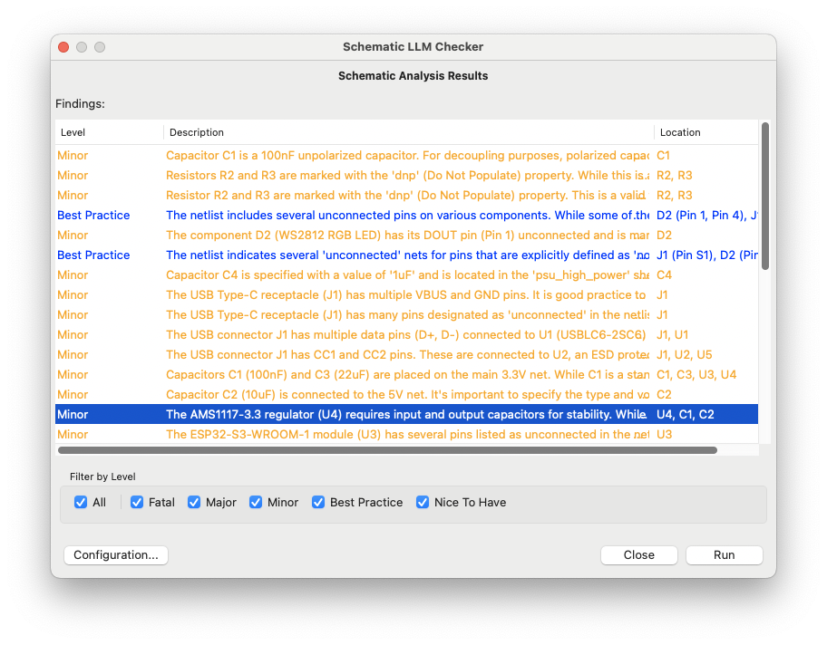

# kicad-llm-plugin

This plugin lets you inspect your schematic with an LLM (you can choose the model), and generate suggestions around how to
improve your design. It will identify fatal flaws, good practices and nice-to-haves. It supports models which run locally
and remotely.

## Installation

While this is not yet released to the kicad plugin repository, you can clone this repository into your plugin directory,
for example: `~/Documents/KiCad/9.0/plugins` on Mac OS X.

## Usage

- Launch kicad, and open your project.
- Open the PCB for the project, even if no PCB exists yet.
- Click the robot icon in the top toolbar.
- Select your model and enter the API key.
- Click Run.

## Contributing

Send me your PRs yo.

## Ideas

- (Pull datasheets for all components)[https://old.reddit.com/r/KiCad/comments/1nsvhj2/llmbased_plugin_for_kicad_for_analysing_schematics/ngpmehr/].

## License

Distributed under the MIT License. See [`LICENSE`](LICENSE) for details.